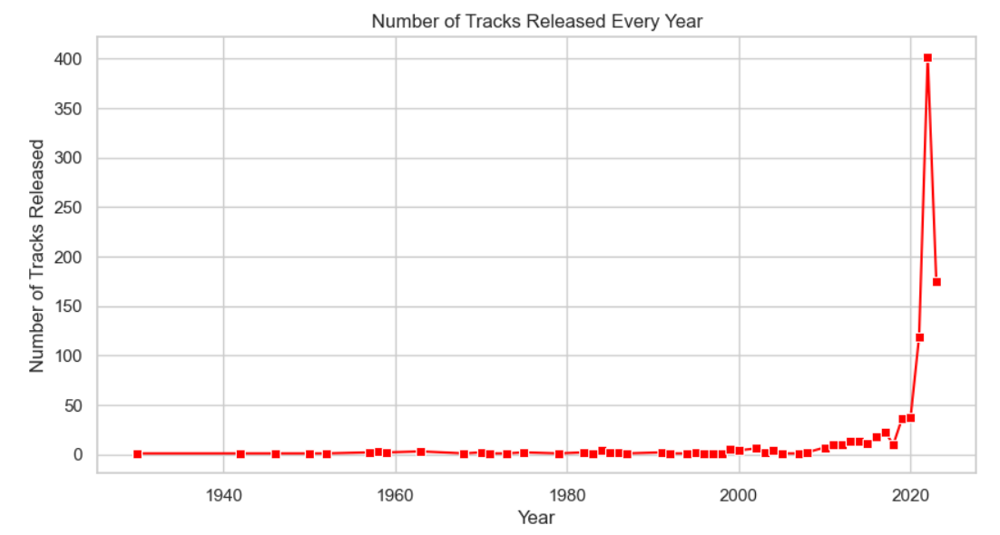
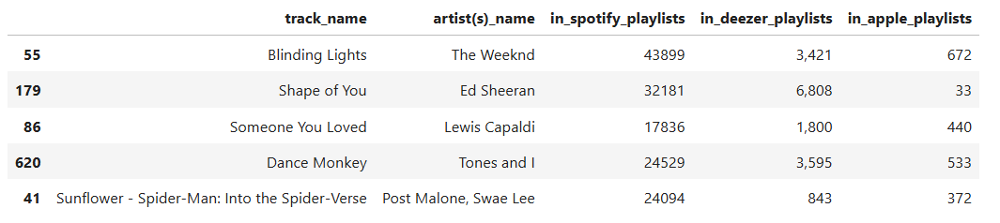
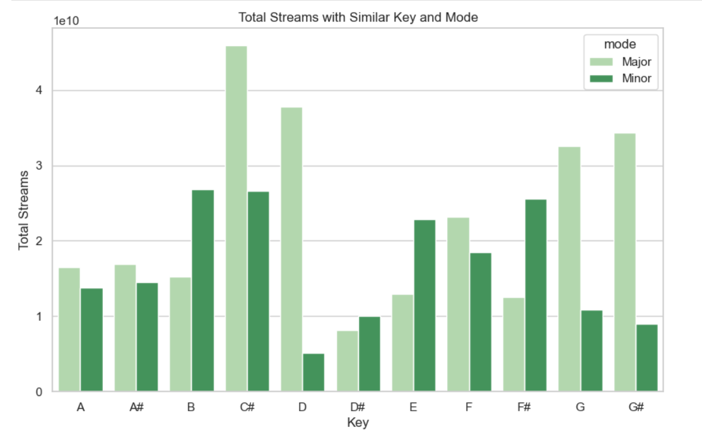

# Python - Spotify-2023-Dataset
### Exploratory Data Analysis on Spotify 2023 Dataset

* This task aims to analyze, visualize, and interpret the data to extract meaningful insights.

## 5 G's in executing the task:
#### G1: 
Begin by familiarizing yourself with the structure of the data set by checking for missing values and data types, performing an initial exploration to understand the different features available.

#### G2: 
Provide a overview by giving a summary statistics of key metrics such as the number of streams, release dates, and musical attributes (e.g., BPM, danceability)

#### G3: 
Use appropriate visualizations such as bar charts, histograms, and scatter plots to uncover trends and patterns in the given data. Ensure that the plots are well-labeled and easy to understand.

#### G4: 
Investigate correlations between different variables and provide insights based on the findings. Explore relationships between streams and other musical characteristics like energy and playlist.

#### G5: 
Based on you analysis, offer any insights or recommendations regarding the tracks, artist, or musical trends that could be useful for understanding what makes a track popular.

## Background
#### Data
is the representation of raw elements or unprocessed facts, including numbers and symbols to text and images.
#### Data Wrangling 
involves manipulation and transformation of data frames in preparation for data analytics.
#### Data Visualization
is the graphical representation of any information or data.

## How to perform the task?
* Initially, you need to be familiar with the different codes and function that is incorporated in the Data Wrangling and Visualization library.
* I used Jupyter Notebook which is pre-installed in the Anaconda Navigator in coding the task.

## For G1:
1. Create a new jupyter notebook
---
2. Import the important libraries to be used specifically pandas, matplotlib, and seaborn.
---
3. Using the read function, load the given csv file (spotify-2023.csv) to obtain the data needed. Make sure that your ipynb file and the csv file is in the same location.
---
4. Determine the shape, DataType of the columns present and the missing values of the DataFrame.

## For G2:
1. Summarize the statistics in each variable in the loaded DataFrame by using the describe function.

## For G3:
1. Convert the non-numeric data into numeric values in order to use the needed data in visualization.
---
2. Use the most appropriate visualization for uncovering the trends and patterns in the data.

## For G4:
1. Similarly, convert the non-numeric data into numeric values in order to use the needed data.
---
2. Summarize the correlation values and use the appropriate visualizations in plotting for the required data.

## For G5:
* Based on the data visualization and analysis performed, people love a track performed by fewer artists than many. Listeners prefer a single or small collaboration over a large group. The higher the energy percentage in a track, the more popular it will be. There is also a trend wherein tracks included in more playlists and charts tend to have more streams, which helps them gain popularity. These are the observations that will help to supplement understanding of what makes a track popular.

## Guide Questions / Output
### Overview of the Dataset
---
* How many rows and columns does the dataset contain?
---

The dataset contains 953 rows and 24 columns (953x24).

---
* What are the data types of each column? Are there any missing values?
---
 

The data types in each column is mainly 64-bit signed integer and object. There are missing value specifically in the 'in_shazam_charts' column and 'key' column.

---
### Basic Descriptive Statistics
---
* What are the mean, median, and standard deviation of the streams column?
---

The 'streams' column mean is 514137424.93907565. Median is 290530915.0. Standard Deviation is 566856949.0388832.

---
* What is the distribution of released_year and artist_count? Are there any noticeable trends or outliers?
---

As seen in the histogram, the released year distribution increased in 1980's but experienced a downfall in value in the following years not until the 2000's wherein the release count continually increased up until 2020.

In the given histogram of artist count distribution, it is seen that a there is a trend of high frequency when there is only low amount of releases per artist and the frequency goes down as the number of release increases.

### Top Performers
---
* Which track has the highest number of streams? Display the top 5 most streamed tracks.
---

Based on the given data, here are the top 5 most streamed tracks. The track that has the highest number of streams is Blinding Lights followed by Shape of You, Someone You Loved, Dance Monkey, and Sunflower - Spider-Man: Into the Spider-Verse. 

---
* Who are the top 5 most frequent artists based on the number of tracks in the dataset?
---

Here are the top 5 most frequent artist based on the number of tracks in the dataset. Taylor Swift being the highest, followed by The Weeknd, Bad Bunny, SZA, and Harry Styles.

### Temporal Trends
---
* Analyze the trends in the number of tracks released over time. Plot the number of tracks released per year.
---

By observing the lineplot, it is evident that the track releases have increased starting from the 2015's and significantly increased after 2020 reaching the 400 tracks mark.

---
* Does the number of tracks released per month follow any noticeable patterns? Which month sees the most releases?
---

As displayed, the number of tracks released per month follows a noticeable pattern between the 1st and 2nd quarters of the year wherein the track releases are significantly high at the start of the year, then drop to 60 and go up to 80. In the second quarter, from approximately 65 track releases, it goes up again, exceeding the 120 mark, then goes down dramatically until August, then starts to rise again until the 80 mark as the Christmas Season is nearing. January and May see the most track releases since January is the start of the year, and May is the sweetest spot for a track release since it is spring season for the Northern Hemisphere and autumn for the Southern Hemisphere.  

### Genre and Music Characteristics
---
* Examine the correlation between streams and musical attributes like bpm, danceability_%, and energy_%. Which attributes seem to influence streams the most?
---

Visualizing the data via heatmap, it is seen that bpm, danceability_%, and energy_% has only a small influence to streams. Within the three, danceability_% has correlates the most with streams.

---
* Is there a correlation between danceability_% and energy_%? How about valence_% and acousticness_%?
---

Plotting the values in the heatmap, It is confirmed that there is a correlation between danceability_% and energy_%, which suggests that danceable songs have high energy. On the other hand, valence_% and acousticness_% have a slight correlation wherein as acousticness_% increases, valence_% decreases.

### Platform Popularity
---
* How do the numbers of tracks in spotify_playlists, deezer_playlists, and apple_playlists compare? Which platform seems to favor the most popular tracks?
---

There is a significant differences between the different platforms. Spotify playlists seems to be the most popular platform scoring the highest track numbers (4955719), followed by deezer playlists (95913) and apple playlists having the lowest track numbers (64625).

The platform that seems to favor the top 5 most popular tracks is still Spotify followed by Deezer and Apple Music at last. 

### Advanced Analysis
---
* Based on the streams data, can you identify any patterns among tracks with the same key or mode (Major vs. Minor)?
---

Based on the graph, there is a pattern among tracks with the same key or mode wherein keys C# Major, D Major, and G# Major appear to be streamers' listening preferences and are gaining popularity, rewarding the track with a lot of streams. 

---
* Do certain genres or artists consistently appear in more playlists or charts? Perform an analysis to compare the most frequently appearing artists in playlists or charts.
---

Certain genres and artists appear in more playlists or charts across different platforms. Based on data analysis and visualization, the Weeknd appears the most in playlists and charts across different platforms. This may be because of his tracks' combined pop and R&B genres. Taylor Swift stands out for her narrative storytelling in her tracks. Ed Sheeran for the melodic hook of his songs across listeners. Harry Styles was really famous for being a member of one of the most followed boy band groups. Because of his extraordinary rapping skills, Eminem is one of the most famous hip-hop legends worldwide. Different artists, genres, and a variety that appears consistently in more playlists or charts cater to the consumer's mood/vibe/hearing cravings.

## Author 
Pangan, Raven G.
## References 
* ECE2112 Lecture Notes by Prof. Engr. Ma. Madecheen S. Pangaliman, MSc and Prof. Engr. Nico John Leo S. Lobos, MSc, ECE, ECT
* README.md file by SuperMadee
* Spotify Data Analysis Project | Spotify Data Analysis Using Python | Data Analysis by Simplilearn. https://www.youtube.com/watch?v=8d7ywKCm6HI
* Change Data Types with to_numeric() | Pandas | DataFrame by BigPlot. https://www.youtube.com/watch?v=MU2KsvDZvIU
* ChatGPT

